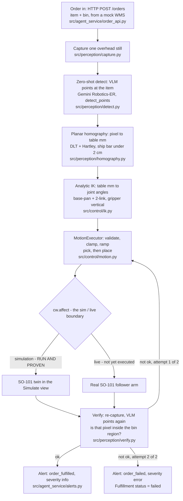

# Order-Driven Zero-Shot Picking Cell (SO-101 × Cyberwave)

A Physical AI agent built solo for the **Cyberwave Builders Program — Cohort 2** (Jul–Aug 2026).
Agent name: **PickPlaceAgent**. Builder: Devan Sedmak.

> **Honest status in one line:** the full agent loop — order → perceive → reason → act → **verify → retry
> → alert** — runs end-to-end today; the pick/place motion has been executed on the real SO-101 twin **in
> simulation**, and the closed verification loop is proven **offline with all three branches**. The
> overhead camera is not yet mounted, so the live-hardware run and the real calibration numbers are still
> open. Nothing below is claimed as working unless there is a command or a test behind it — see
> [Status](#status-what-actually-works).

---

## Problem

Micro-fulfillment cells and small warehouses add new SKUs constantly. Classic pick-and-place automation
answers with per-item engineering: a new fixture, a new template, a re-labelled dataset, or a retrained
policy for every item that enters the catalogue. That cost is fine for a line running one SKU a million
times and absurd for a shelf that gains three new products a week — so those cells stay manual. The gap is
not gripper hardware, it is **the perception and integration cost of the long tail**, plus the fact that a
blind pick-and-place has no idea whether it actually fulfilled the order.

## Solution

An order-driven picking cell where **the item name is the only configuration**. A warehouse order
`{"order_id": "SO-1042", "item": "red marker", "bin": "A"}` arrives over HTTP (`POST /orders`), and the
agent:

1. **Perceives** — grabs one still frame from a fixed overhead camera.
2. **Reasons** — asks a Cyberwave-hosted vision-language model to *point* at the named item
   (open-vocabulary, zero-shot: no training data, no class list, no fine-tune), then projects that pixel
   through a calibrated planar **homography** into table millimetres and through analytic **IK** into
   joint angles.
3. **Acts** — executes pick then place through a safety-wrapped motion executor (plan validation,
   per-joint clamp, ramped interpolation).
4. **Verifies (the thesis)** — re-looks at the scene, asks the *same* VLM to point at the item again, and
   tests geometrically whether that point now lies inside the target bin's region. Success ⇒ a
   `order_fulfilled` alert back to the platform. Failure ⇒ **retry once**, then a `order_failed`
   **ERROR** alert and `status="failed"`.

Step 4 is what makes this an agent instead of a recorded trajectory: the loop is closed on the outcome,
not on the command. Adding a new SKU is a new string in an order — no retraining, no code change.

Use case detail: [docs/demo-scenario.md](docs/demo-scenario.md) · design decisions:
[decisions.md](decisions.md) · commands and troubleshooting: [runbook.md](runbook.md).

## Architecture



Everything left of the `cw.affect` diamond is plain Python and unit-tested offline. The same code targets
sim or hardware by switching that one call — the control layer is deliberately twin-agnostic (canonical
joint keys `"1".."6"` translated to the twin's real names only at the SDK boundary), which is also the
demo-day fallback path to a remote Agilex Piper ([D14](decisions.md)).

The orchestration loop itself is [`src/agent_service/loop.py`](src/agent_service/loop.py); verification is
**injected**, so with `verify=None` the loop degrades cleanly to the open-loop walking skeleton it grew
from.

## Tech stack

| Layer | Choice | Code |
|---|---|---|
| Order intake | HTTP webhook receiver: `POST /orders` → validated `Order` → the loop → JSON result; `GET /health`; fulfilment serialized behind a lock (one physical arm). **Stdlib `http.server` only** — no web framework added days before ship (debt logged in-module). Offline order replay via `OrderSource` | [src/agent_service/order_api.py](src/agent_service/order_api.py), [src/wms_mock/orders.py](src/wms_mock/orders.py) |
| Perception — capture | One-shot V4L2 still (OpenCV, else **ffmpeg**), auto-selecting the kit camera by `/sys` name; platform fallback `twin.get_frame(source="cloud")`. Deliberately **never** depends on a live stream | [src/perception/capture.py](src/perception/capture.py) |
| Perception — detect | Cyberwave-hosted VLM (**Gemini Robotics-ER**) via `cw.mlmodels.run(model, image=…, prompt=item, structured_task="detect_points")`; output `[{"point": [y, x], …}]` on a 0–1000 grid, decoded in exactly one place | [src/perception/detect.py](src/perception/detect.py) |
| Geometry | Planar pixel→table homography, DLT with Hartley isotropic normalization, JSON persistence, reprojection error with a **< 2 cm** ship bar. Pure numpy | [src/perception/homography.py](src/perception/homography.py) |
| Kinematics | Analytic base-pan + 2-link planar IK, elbow-up, gripper held vertical; `Unreachable` outside the envelope; FK∘IK round-trip is the correctness invariant | [src/control/ik.py](src/control/ik.py) |
| Control | `MotionExecutor`: allow-listed action types, all-or-nothing plan validation, **per-joint clamp immediately before the SDK call**, 20 Hz ramped interpolation with full-pose re-send, `dry_run` mode | [src/control/motion.py](src/control/motion.py) |
| Verification | Re-uses the same `detect_points` call, then a pure point-in-rectangle test against surveyed bin regions (calibration data, not perception) | [src/perception/verify.py](src/perception/verify.py) |
| Agent loop | `fulfill_order`: pick → place → verify → retry once → alert; never raises, always returns a `Fulfillment` | [src/agent_service/loop.py](src/agent_service/loop.py) |
| Observability | Twin alerts via `robot.alerts.create(...)`, `category="business"`, types `order_fulfilled` / `order_failed` | [src/agent_service/alerts.py](src/agent_service/alerts.py) |
| Platform | Cyberwave SDK **0.5.3** (pinned), Cyberwave Edge Core + `cyberwaveos/so101-driver` in Docker, twin `aa1dd0ad-…`, `cw.affect("simulation")` | [runbook.md](runbook.md) |
| Calibration tooling | Interactive click-to-calibrate for the homography and the bin regions, each with a non-interactive fallback and an offline `--selftest` | [tools/](tools/) |
| Runtime | Python 3.10, numpy, OpenCV, python-dotenv, pytest (**184 tests**) | [pyproject.toml](pyproject.toml) |
| Hardware | SO-101 leader + follower (WowRobo pre-assembled), 2 MP USB overhead camera, Ubuntu 22.04 laptop as the edge node | [docs/so101/](docs/so101/), [hardware/config/](hardware/config/) |

Explicitly **not** used: no depth camera (planar homography instead, [D5](decisions.md)), no local
GroundingDINO/BERT stack in the primary path (the hosted VLM replaced a 30–45 s/pick CPU pipeline,
[D10](decisions.md)/[D13](decisions.md)), no VLA training ([D18](decisions.md)), no ROS, no C++.

## Status — what actually works

Legend: ✅ verified by a command or a test · 🟡 built and tested offline, but not yet exercised on the
real thing · ⬜ blocked on the un-mounted camera / a live run · ❌ dropped.

| Capability | Status | Evidence / what's missing |
|---|---|---|
| Order → pick → place → alert, on the real twin in **simulation** | ✅ | Ran end-to-end against twin `aa1dd0ad-…`; alert dispatched ([progress.md](progress.md), Session 5C) |
| Closed verification loop: verify → retry once → ERROR alert | ✅ **offline, all three branches** | `run_order --verify`, `--verify --verify-fail 1`, `--verify --verify-fail 2` (see [Reproduce](#reproduce-offline-no-hardware-no-credits)) + 16 tests |
| HTTP order intake: `POST /orders` drives the loop | ✅ offline | A real `curl` returns `{"status": "fulfilled", "stages": [...], "attempts": 2, ...}`; 18 tests cover 200/409/422/413/405/404/500 and concurrency |
| Motion safety: validation, per-joint clamp, ramping | ✅ | 17 tests in `tests/test_motion.py`, incl. clamp-before-SDK |
| VLM output decoding, `[y, x]` / 0–1000 convention, target selection | ✅ offline | 11 tests; the model itself was validated on real desk photos in the Playground ([D13](decisions.md)) |
| Pixel→table homography math + < 2 cm bar | ✅ offline | 9 tests: exact recovery, held-out projection, outlier flagging, inverse round-trip |
| Analytic IK + FK∘IK round-trip | ✅ offline | 12 tests over a reachable grid |
| `detect → homography → IK` chain **wired into the runnable loop** | ✅ offline | `run_order --perceive` picks where the item is *seen*: `src/perception/locate.py` composes capture→detect→homography, then `poses.pick_plan_from_table` → IK. Proven offline with a canned VLM response and a synthetic calibration (command in [Reproduce](#reproduce-offline-no-hardware-no-credits)); falls back to the hardcoded table with a printed reason if uncalibrated |
| Executor joint limits match the real arm | ✅ | Derived from **our twin's own calibration** ([joint-ranges.md](hardware/config/joint-ranges.md)). The previous hand-guessed ±60° silently clamped a real perceived pick (elbow needed −83°, arm reaches ±96.6°) — caught offline before it could waste a hardware session |
| Real VLM API call from our code (`--run`) | 🟡 not yet spent | Code path is complete; no overhead frame exists yet and per-call credit cost was never published (see [Platform feedback](#platform-feedback-and-blockers)). Also needs `pip install pillow` |
| Overhead camera mounted + homography calibrated | ⬜ | Camera physically unmounted; no `hardware/config/homography.json` yet |
| Bin pixel regions surveyed | ⬜ | No `hardware/config/bin-regions.json`; `--sim --verify` therefore **degrades to unverified with a printed warning** rather than crashing |
| Calibration tooling for both of the above | ✅ | `tools/calibrate_homography.py --selftest` and `tools/pick_bin_regions.py --selftest` both pass offline; the homography tool **refuses to save** a fit worse than 2 cm |
| Frame capture from the kit camera | 🟡 code done, 57 tests | Device auto-selection, OpenCV/ffmpeg backends, twin-frame fallback — never yet run against the actual mounted camera |
| Measured IK link lengths | ⚠ **placeholders** | `ik.py` ships SO-ARM100-ballpark numbers, not measured ones. Four ruler measurements: [hardware/config/link-lengths.md](hardware/config/link-lengths.md) |
| Full loop on real hardware (`cw.affect("live")`) | ⬜ | Both arms paired and calibrated, driver verified healthy ([D17](decisions.md)); the live run is a **goal, not a submission gate** ([D9](decisions.md)/[D16](decisions.md)) |
| Cyberwave **Workflow** webhook wired to the receiver | ⬜ not built | The receiver exists and works; pointing a platform Workflow's `http_request` node at it was cut for time. Also still stdlib-only rather than FastAPI (deliberate — see [Known gaps](#known-gaps-and-debt)) |
| VLA / SmolVLA fallback | ❌ dropped | [D18](decisions.md): server-side training issues, 6–7 h per run, and training seizes the twin we need for the demo |

## Reproduce (offline: no hardware, no credits)

Every command below was run on this machine. Nothing here touches the network, a camera, a robot, or a
credit balance.

```bash
python3 -m venv .venv
.venv/bin/pip install "cyberwave[camera]" numpy python-dotenv pytest   # add pillow for the --run paths

# 1. The whole test suite (⚠ the autoload flag: a sourced ROS Humble leaks a broken pytest plugin)
PYTEST_DISABLE_PLUGIN_AUTOLOAD=1 .venv/bin/python -m pytest -q            # -> 184 passed

# 2. The agent loop, open (walking-skeleton behaviour): order -> pick -> place -> fulfilled alert
.venv/bin/python -m src.agent_service.run_order
.venv/bin/python -m src.agent_service.run_order --item eraser --bin A

# 3. THE THESIS — the closed loop, all three branches, with a stub verifier
.venv/bin/python -m src.agent_service.run_order --verify                   # verified -> fulfilled
.venv/bin/python -m src.agent_service.run_order --verify --verify-fail 1   # fails once -> retry -> fulfilled
.venv/bin/python -m src.agent_service.run_order --verify --verify-fail 2   # fails twice -> failed + ERROR alert

# 4. Zero-shot detection maths on a canned VLM response (exercises the real parser)
.venv/bin/python -m src.perception.detect_frame --item eraser

# 4b. THE FULL ZERO-SHOT PICK, offline: canned VLM point -> homography -> IK -> joint plan.
#     Synthesize a calibration, then pick from a "seen" pixel instead of a pose table.
.venv/bin/python tools/calibrate_homography.py \
    --pixels "200,150" "1000,150" "1000,600" "200,600" --sheet 297,210 --out /tmp/h.json
echo '[{"point": [420, 520], "label": "red marker"}]' > /tmp/det.json
.venv/bin/python -c "from PIL import Image; Image.new('RGB',(1280,720)).save('/tmp/f.jpg')"
.venv/bin/python -m src.agent_service.run_order --perceive \
    --homography /tmp/h.json --frame /tmp/f.jpg --detections /tmp/det.json
#   -> 👁 'red marker' at px=(666, 302) → table (173, 71) mm
#   -> pose {1=+22.4°, 2=+39.4°, 3=-83.3°, 4=-46.1°, ...}   (IK-derived, not the pose table)
.venv/bin/python -m src.agent_service.run_order --perceive
#   -> ⚠ perceived picking disabled: no calibration ... → falls back to the hardcoded poses

# 5. Order-driven, for real: a mock WMS POSTs an order and the agent runs
.venv/bin/python -m src.agent_service.order_api --verify --verify-fail 1   # receiver on :8080, dry-run
#   then, in a second terminal (the banner prints this exact command):
curl -sS -X POST http://127.0.0.1:8080/orders -H 'Content-Type: application/json' \
     -d '{"order_id": "SO-1042", "item": "red marker", "bin": "A"}'
#   -> {"status": "fulfilled", "stages": ["picked","placed","verify-failed","retried",
#       "picked","placed","verified","alerted"], "attempts": 2, ...}

# 6. Motion layer alone, no connection
.venv/bin/python -m src.control.hello_sim --dry-run

# 7. The calibration tools prove themselves with no camera and no display
.venv/bin/python tools/calibrate_homography.py --selftest
.venv/bin/python tools/pick_bin_regions.py --selftest
```

That `stages` list is the whole thesis in one line of JSON: picked, placed, **verification failed**,
retried, picked, placed, **verified**, alerted.

## Reproduce (platform: moves the twin in SIMULATION)

Needs `CYBERWAVE_API_KEY` and `CYBERWAVE_TWIN_ID` in `.env`. **Simulation only** — these entrypoints have
no live-hardware path by construction, and watching them requires the dashboard's *Simulate* view.

```bash
.venv/bin/python -m src.control.hello_sim                    # gesture plan on the twin
.venv/bin/python -m src.agent_service.run_order --sim        # the loop, on the twin
.venv/bin/python -m src.agent_service.run_order --sim --verify   # adds the real camera + VLM verification
.venv/bin/python -m src.agent_service.order_api --sim        # POSTed orders move the twin
```

`--sim --verify` is the only path that spends credits, and it needs the surveyed bin regions; without them
it prints `⚠ verification disabled` and continues unverified.

## Reproduce (hardware, once the camera is mounted)

```bash
.venv/bin/python -m src.perception.capture                        # list V4L2 devices, auto-select the kit cam
.venv/bin/python -m src.perception.capture --save frame.jpg       # grab one still (raise --warmup if black)
.venv/bin/python -m src.perception.detect_frame --run -i frame.jpg -q "red marker" --save out.png

# calibration 1: pixel -> table homography. Click 4 corners of an A4 sheet taped to the mat,
# origin corner at the arm base. A fit worse than 2 cm is REFUSED, not saved.
.venv/bin/python tools/calibrate_homography.py --sheet 297,210
.venv/bin/python tools/calibrate_homography.py --image frame.jpg --sheet 297,210   # reuse a frame
.venv/bin/python tools/calibrate_homography.py --points "812,455=0,0" ...           # no display needed

# calibration 2: bin pixel rectangles, the last missing input to the closed loop
.venv/bin/python tools/pick_bin_regions.py --image frame.jpg
.venv/bin/python tools/pick_bin_regions.py --regions "A=100,100,300,240" "B=340,100,540,240"

# calibration 3: measure four link lengths with a ruler, edit src/control/ik.py
```

Procedure and gotchas: [hardware/config/cameras.md](hardware/config/cameras.md) and
[hardware/config/link-lengths.md](hardware/config/link-lengths.md). Both tools also accept
non-interactive input, so a misbehaving display never blocks the calibration.

## Demo scenario

**Desk-Supply Micro-Fulfillment Cell** — chunky, nameable desk items (blue marker, orange highlighter,
white eraser, glue stick) on a light mat, plus labelled bins A/B/C. The headline moment is the
**zero-shot reveal**: an item that was never configured anywhere in the codebase is ordered, and the agent
picks it with no retraining and no code change.

Full spec: [docs/demo-scenario.md](docs/demo-scenario.md) · 5-minute demo runbook and judge Q&A:
[docs/demo-script.md](docs/demo-script.md) · video shot list: [docs/video-script.md](docs/video-script.md).

## Tests

`PYTEST_DISABLE_PLUGIN_AUTOLOAD=1 .venv/bin/python -m pytest -q` → **184 passed** in under a second. No
test needs a network, a robot, or a credit; every risky convention is pinned by a test rather than by a
comment.

| File | Tests | What it pins down |
|---|---|---|
| `tests/test_capture.py` | 63 | Device enumeration and auto-selection (the built-in laptop camera is always excluded), backend choice, black-frame and busy-device failures, twin-frame fallbacks |
| `tests/test_order_api.py` | 18 | `POST /orders` 200 / 409 / 422 / 413, 405 with `Allow`, 404, a runner that explodes → JSON 500, and serialization of concurrent orders |
| `tests/test_motion.py` | 17 | Clamping, every validation rejection, clamp-before-SDK ordering, ramp monotonicity, multi-joint sync, name-map translation |
| `tests/test_verify.py` | 16 | All three verdicts (not seen / outside bin / inside bin), region normalization, calibration I/O, missing-calibration error |
| `tests/test_agent_loop.py` | 15 | Order parsing, pose lookup, alert payloads, the retry-then-fail path, unknown item/bin failing **without** raising and **without** motion |
| `tests/test_ik.py` | 12 | FK∘IK round-trip over a reachable grid, elbow-up branch, `Unreachable` envelope, limit checking |
| `tests/test_detect.py` | 11 | The `[y, x]` / 0–1000 → pixel convention, box centres, clamping, malformed-entry skipping, queued-run guard |
| `tests/test_homography.py` | 9 | Exact affine + projective recovery, held-out projection, the 2 cm tolerance flag, inverse round-trip, degenerate-input guards |
| `tests/test_locate.py` | 14 | `capture → detect → homography → table mm` composition, item-not-found, saved-frame path, and the pixel→mm numbers against independently computed values |
| `tests/test_seam.py` | 9 | The whole `detect → homography → IK → motion plan` chain on synthetic VLM output, **and** `--perceive`'s resolution logic (IK path when calibrated, hardcoded fallback when not) |

The two conventions most likely to cause a silent, expensive bug — the VLM's `[y, x]` / 0–1000 output
order and the twin's underscore-prefixed joint names — are each encoded in exactly one place and covered
by tests. Both were discovered the hard way (see [D15](decisions.md) and Session 4 in
[progress.md](progress.md)).

## Known gaps and debt

Stated plainly, because a status table that only says ✅ is not information:

- **The perceived pick path is wired but has never seen a real frame.** `run_order --perceive` runs the
  real `locate → homography → IK` chain and is proven offline against a canned VLM response, but every
  pixel it has ever consumed was synthetic. Without `hardware/config/homography.json` it deliberately
  falls back to the hardcoded `PICK_POSES` in
  [src/agent_service/poses.py](src/agent_service/poses.py) and says so — so the *default* demo is still
  the scripted pick until the camera is mounted.
- **The gripper open/close convention is unverified against the real arm.** `poses.py` commands open at
  −40°, but the follower's calibrated gripper span is 0°→128.9°, so −40° is outside it. Whether the
  driver applies its own sign/offset is unknown, and guessing could command a *close* when we mean
  *open* — so the limit was left untouched pending a 2-minute gripper-only check
  ([joint-ranges.md](hardware/config/joint-ranges.md) § gripper convention). **Do this before any
  full-loop live run.**
- **IK link lengths are unmeasured placeholders.** The solver is self-consistent (FK∘IK is green) but the
  absolute mapping from table mm to servo angles is only as good as four numbers nobody has measured yet.
- **No live-hardware run of the full loop.** Sim on the real twin, yes. Real arm, not yet.
- **Bin `C` and two demo SKUs exist in the scenario doc but not in `poses.py`** — a consequence of the
  hardcoded pose table that disappears with the IK swap above.
- **Alert `source_type` is hard-defaulted to `"simulation"`** and must be flipped to `"edge"` on the first
  real-hardware run.
- **The order receiver is stdlib `http.server`, not FastAPI.** A deliberate ship-bias call: no web
  framework was in the venv and adding one days before submission was not worth the risk. The injected-
  runner seam is already the right one, so only the transport changes post-cohort — and the platform
  Workflow that would `POST` to it is not wired.
- **The `--run` VLM path and the live verifier need `pip install pillow`**, which is imported lazily and is
  not yet in `pyproject.toml`'s base dependencies.
- Accepted design debt (planar assumption breaks for tall objects; no force sensing, so the grasp is
  open-loop with a fixed close angle) is logged in [decisions.md](decisions.md).

## Platform feedback and blockers

Offered constructively — Cyberwave explicitly asked for it, and every item below cost real evening hours.

1. **Driver versioning is invisible from the outside, and that made a cohort-wide bug expensive.** The
   SO-101 connection failures and empty-episode recordings that hit this cohort traced to a driver
   protocol bug whose fix required pointing **twin metadata** at a newer driver image, plus a
   "special"/dev tag that was later retracted. Diagnosing "am I affected?" meant reading twin metadata,
   inspecting the local Docker image age, and re-pulling by hand
   ([D17](decisions.md)). *Suggestion:* surface driver image + tag + "expected version" in the twin's
   dashboard page with a changelog, and ship a `cyberwave edge doctor` that answers that question in one
   command. Hand-editing twin metadata should never be on the critical path for a builder.
2. **The dashboard camera live stream was unreliable** (disconnects every few seconds, reported by several
   builders during office hours), while the one-shot frame call was solid. We designed
   [capture.py](src/perception/capture.py) to never depend on a stream: one still, three independent
   fallback paths. *Suggestion:* document the one-shot `get_frame` path as the recommended perception
   entrypoint for agents, and expose stream health in the UI instead of letting it fail silently.
3. **Credit cost per model call was never discoverable**, so we self-censored. Builder credits are
   100 (50 + 50) but only 50 were visible in the account, and no per-call cost is published for
   `cw.mlmodels.run` on Gemini Robotics-ER. Playground testing being free (0 credits) was genuinely
   great and is what let us validate the model on real photos. But since we could not predict what a
   scripted loop would cost, **we never spent a single real API detection call** and instead validated the
   whole parser offline against canned responses. That is defensible engineering, yet it means our
   perception path met the real API only in the Playground. *Suggestion:* show per-call credit cost in the
   model catalogue plus a running usage meter.
4. **The Python model-inference surface is undocumented.** Docs cover the Workflow "Call Models" node, but
   the SDK path `cw.mlmodels.run(model, image=…, prompt=…, structured_task="detect_points")`, the list of
   structured tasks, and — critically — the **`[y, x]` / 0–1000 output convention** had to be recovered by
   introspecting the installed package ([D15](decisions.md)). A coordinate order that silently mirrors
   every pick is exactly the kind of thing that belongs in bold in the docs. Same class of issue:
   `alerts.create` has no `message` kwarg (details go in `description`) — our first sim run crashed on the
   natural guess; and our twin exposes joints as `_1`..`_6`, not the documented bare digits, which is a
   silent no-op rather than an error until you find `controllable_joint_names()`.
5. **Undocumented controller warm-up.** The first joint command after connecting is dropped
   ("command may have been lost") because it auto-attaches the controller. Every entrypoint here now sends
   a throwaway command and waits ~3 s. *Suggestion:* either block until the controller is attached, or
   document the handshake.
6. **No published SO-101 kinematics.** The assembled-version manual lists no pivot-to-pivot link lengths,
   and none are exposed on the twin/catalogue page, so anyone writing IK must measure their arm with a
   ruler ([hardware/config/link-lengths.md](hardware/config/link-lengths.md)). *Suggestion:* publish link
   lengths or the URDF numbers alongside the SO-101 asset — it is a five-line table that unblocks every
   builder attempting analytic IK.

None of this stopped the project; all of it shaped which 20% got cut.

## Repo layout

| Path | What |
|---|---|
| `src/perception/` | `capture` (still frames) · `detect` (zero-shot VLM) · `homography` (pixel→table) · `verify` (the thesis) |
| `src/control/` | `motion` (clamp + ramp executor) · `ik` (analytic) · `sim_session` (connect/warm-up) · `hello_sim` |
| `src/agent_service/` | `loop` (the agent) · `poses` · `alerts` · `run_order` (CLI entrypoint) · `order_api` (webhook receiver) |
| `src/wms_mock/` | Order value object + mock order source |
| `tests/` | 184 offline unit tests |
| `tools/` | Calibration helpers (homography, bin regions), each with an offline `--selftest` |
| `docs/` | [demo-scenario](docs/demo-scenario.md) · [demo-script](docs/demo-script.md) · [video-script](docs/video-script.md) · distilled platform + SO-101 docs |
| `hardware/config/` | Ports, calibration notes, [cameras](hardware/config/cameras.md), [link lengths](hardware/config/link-lengths.md) |
| Working docs | [roadmap.md](roadmap.md) · [decisions.md](decisions.md) (D1–D18) · [progress.md](progress.md) · [runbook.md](runbook.md) · [questions-discord.md](questions-discord.md) |

## Safety

This repo drives a real arm, so the rules are in the code, not only in the docs: allow-listed action
types, all-or-nothing plan validation, a **per-joint clamp applied immediately before every SDK call**,
ramped interpolation instead of step commands, and dry-run as the *default* for every entrypoint. Hardware
side: **leader PSU 5 V/6 A, follower 12 V/8 A — never swapped**, max payload 400 g, E-stop is Ctrl+C or
unplugging the follower. Full list: [runbook.md](runbook.md) § Safety.
